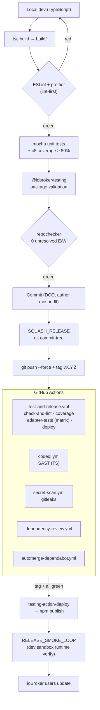
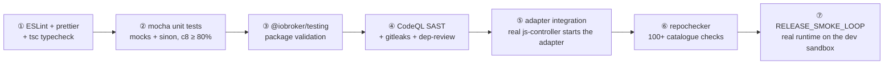

# CI/CD Pipeline

How this adapter is tested, gated, and released. Everything runs on GitHub
Actions on top of the standard ioBroker toolchain (`@iobroker/testing` +
`@alcalzone/release-script`), plus a security layer (CodeQL · gitleaks ·
dependency-review). See also [`TESTING_AND_QUALITY.md`](./TESTING_AND_QUALITY.md).

## Pipeline at a glance

### Test layers (cheapest → most realistic)

## Test layers

The standard ioBroker toolchain — `@iobroker/testing` is the only correct way to
test an adapter — plus coverage and a security layer.

| Layer | What it covers | How | Where |
|---|---|---|---|
| **1. Lint + types** | Style, TS types | ESLint (`@iobroker/eslint-config`) · prettier · `tsc` | `npm run lint`, CI `check-and-lint` |
| **2. Unit (no js-controller)** | Adapter logic against a mock Objects/States DB + mock Adapter | mocha + sinon, `c8` coverage ≥ 80% lines | `test/unit/`, `npm run test:coverage:check` |
| **3. Package validation** | `io-package.json` / `package.json` meet ioBroker requirements | `@iobroker/testing` package tests | `test/package.js`, CI `check-and-lint` |
| **4. Security** | SAST, secrets, dependency CVEs | CodeQL (TS) · gitleaks · dependency-review · Dependabot | CI `codeql.yml` / `secret-scan.yml` / `dependency-review.yml` / `automerge-dependabot.yml` |
| **5. Adapter integration** | Adapter actually starts under a real js-controller | `@iobroker/testing` integration test (matrix ubuntu/windows/macos) | CI `adapter-tests` — *currently the unit suite covers production code; runtime is verified by layer 7* |
| **6. Catalogue gate** | 100+ checks required for the public ioBroker repo | `@iobroker/repochecker` | manual gate before every tag (IOBROKER_REPOCHECKER_FORCE_GATE) |
| **7. Release smoke** | Adapter boots + discovers + write-paths work on a real instance | `iob` dev sandbox (Node 22), tail the log, zero errors | IOBROKER_RELEASE_SMOKE_LOOP — dev sandbox ONLY, never the productive instance |

## GitHub Actions workflows

| Workflow | Trigger | Job(s) | Gate? |
|---|---|---|---|
| `test-and-release.yml` | push main · PR · tag `v*` | check-and-lint (ESLint + package) → coverage-check (c8 ≥ 80%) · adapter-tests (matrix) → **deploy** (npm publish on tag, via `testing-action-deploy`) | ✅ blocking |
| `codeql.yml` | push · PR · weekly cron · dispatch | CodeQL SAST javascript-typescript (security-extended) | ✅ blocking |
| `secret-scan.yml` | push · PR · dispatch | gitleaks full-history (config `.gitleaks.toml`) | ✅ blocking |
| `dependency-review.yml` | PR | dependency-review-action (fail on high) | ✅ blocking (PR) |
| `automerge-dependabot.yml` | Dependabot PR | auto-merge minor/patch dependency bumps | — |

Top-level `permissions: contents: read` on every workflow (least privilege); the
deploy job opts into `id-token: write` + `contents: write` at job level only.

`.gitleaks.toml` allowlists only the **public** Bosch app credentials (the
base64-encoded Firebase API key + the well-known FCM server key) and the
generated/fixture trees (`build/`, `test/`, `backups/`, `coverage/`).

## Release process

Releases go through the `@alcalzone/release-script` + the ioBroker deploy action,
gated by the repochecker. Summary (full rules in the project CLAUDE.md):

1. Pass the **repochecker preflight** (news ≤ 7 langs complete, `CHANGELOG.md`
   absent / `CHANGELOG_OLD.md` present, `engines.node ≥ 22`, current version in
   the README changelog, …).
2. All local gates green: `npm run lint && npm test && npm run test:coverage:check`.
3. **RELEASE_SMOKE_LOOP** on the dev sandbox — build → rsync into the sandbox →
   `iob restart` → tail the log → zero errors / no early `terminate()` /
   exceptions / `Digest 401` loops. Exercise the write-paths
   (intrusion/audio/pan/light/privacy), not just startup. Repeat until clean.
4. Bump `common.version` (Thomas picks every version), add the README changelog
   line, fill all 11 `news` languages.
5. Commit (DCO, author `mosandlt`) → SQUASH_RELEASE → `git push --force` + tag.
6. **IOBROKER_REPOCHECKER_FORCE_GATE** (mandatory): after pushing main and before
   the tag, run the remote `@iobroker/repochecker` — zero unresolved `[E####]`
   **and** `[W####]` except the documented allowlist (version/tag-not-yet-on-npm
   items, `W5060` @aracna/core peerDep, `W4001` repo-PR-pending, `S3032` tag-recut).
7. CI auto-publishes to npm on tag-push (`testing-action-deploy`) — never
   `npm publish` manually. Verify `npm view … version` after ~2 min.
8. Announce: ioBroker forum thread + GitHub Discussion.

> **Scope:** all ioBroker testing runs on the dev sandbox
> (`dev-environments/iobroker-test/`, Node 22), never the productive instance.
